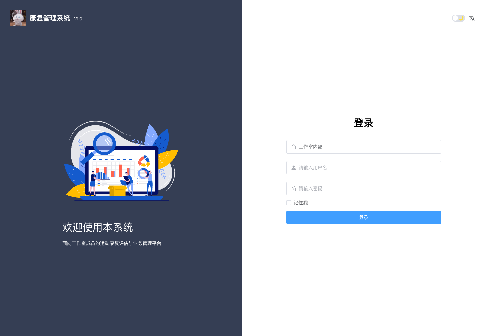
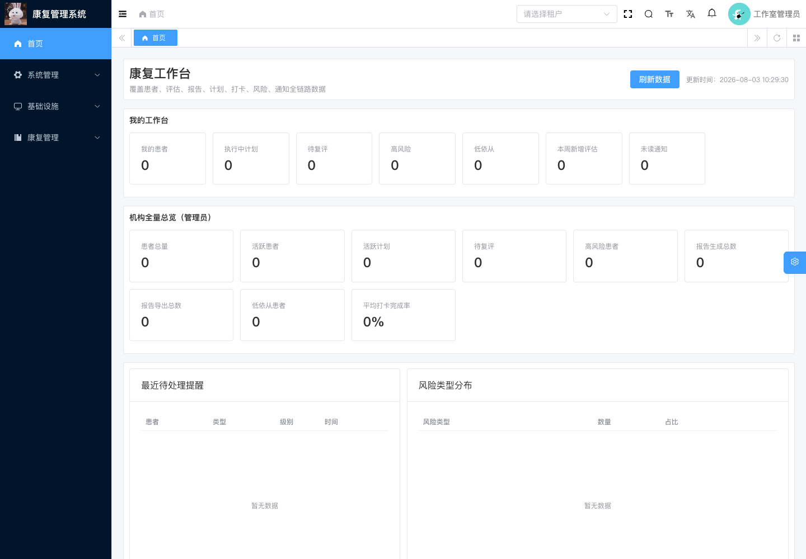
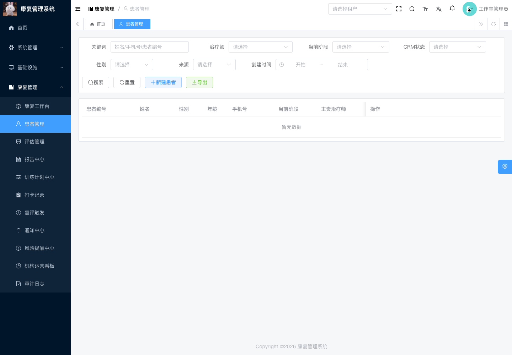
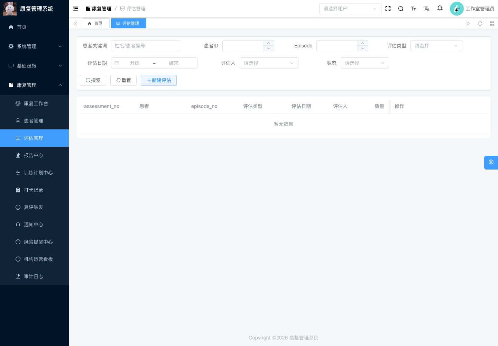
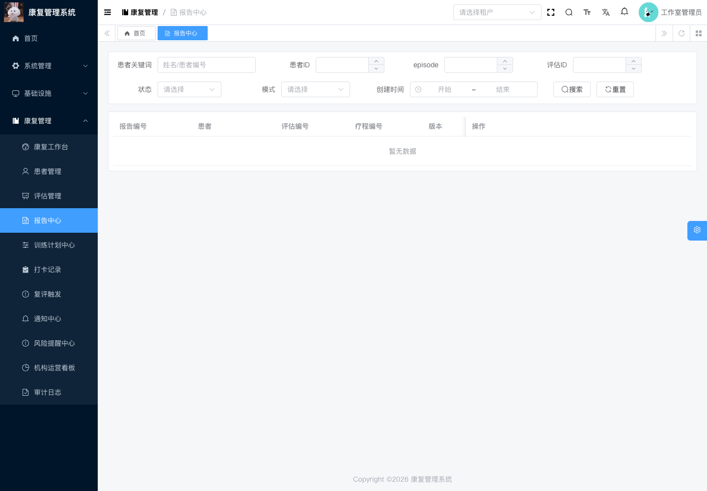
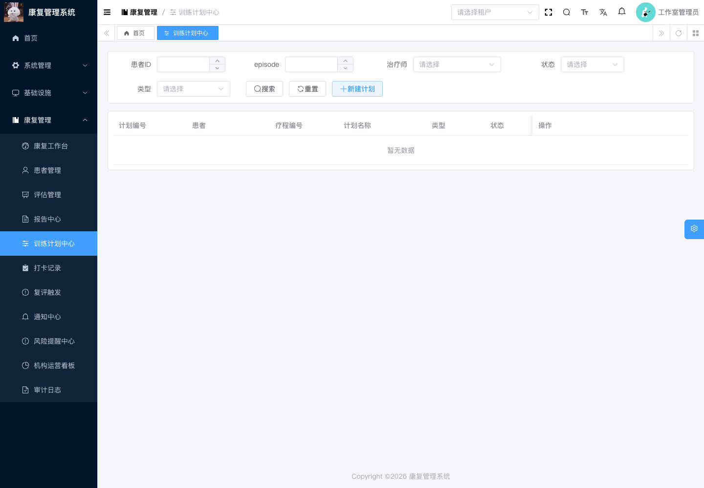
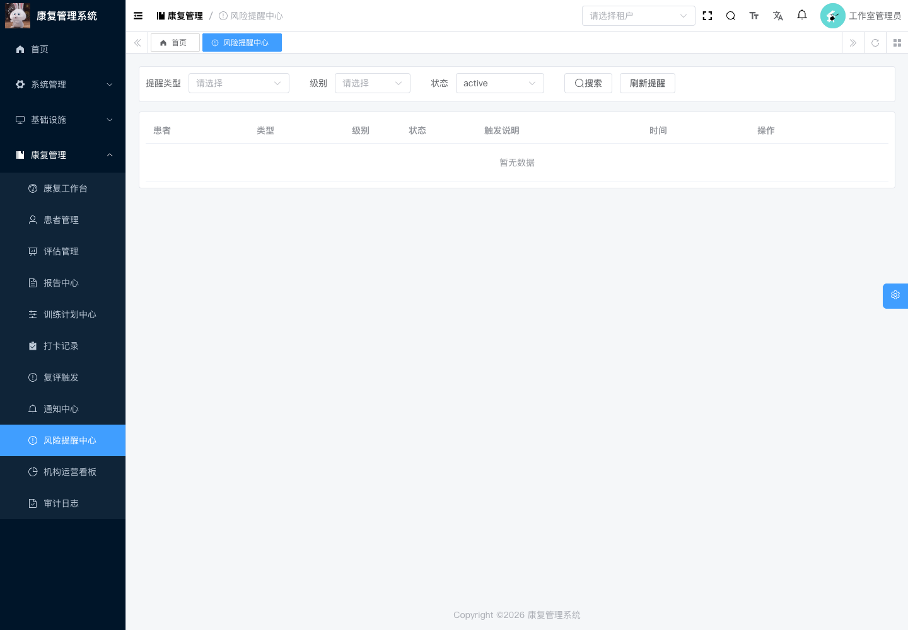
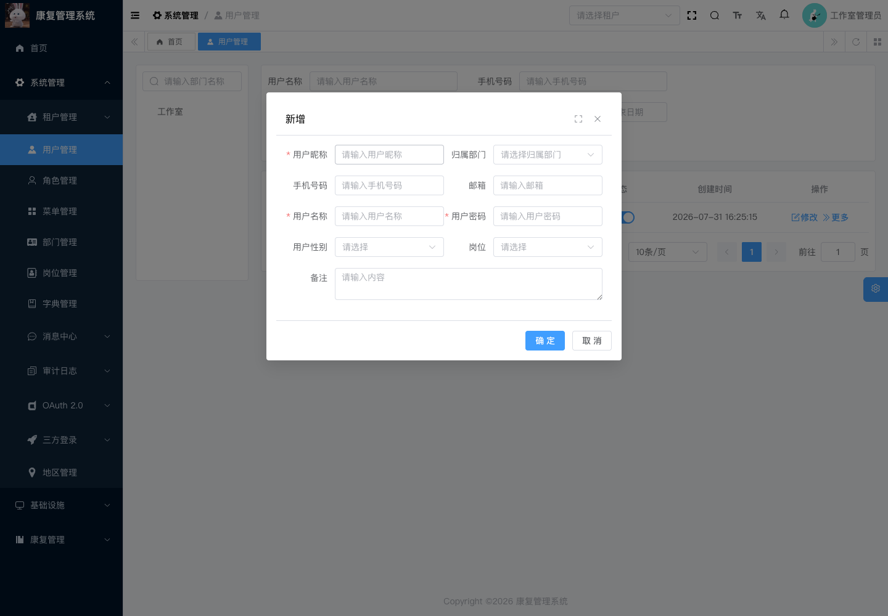
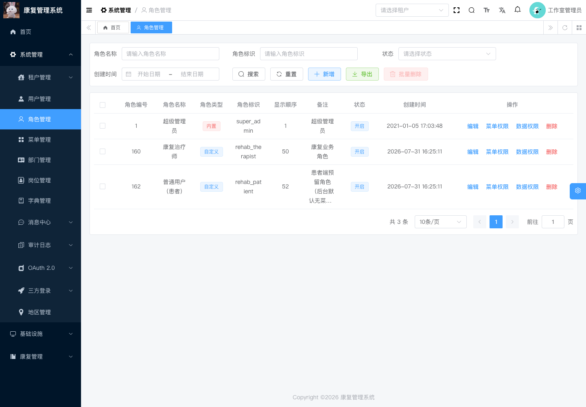
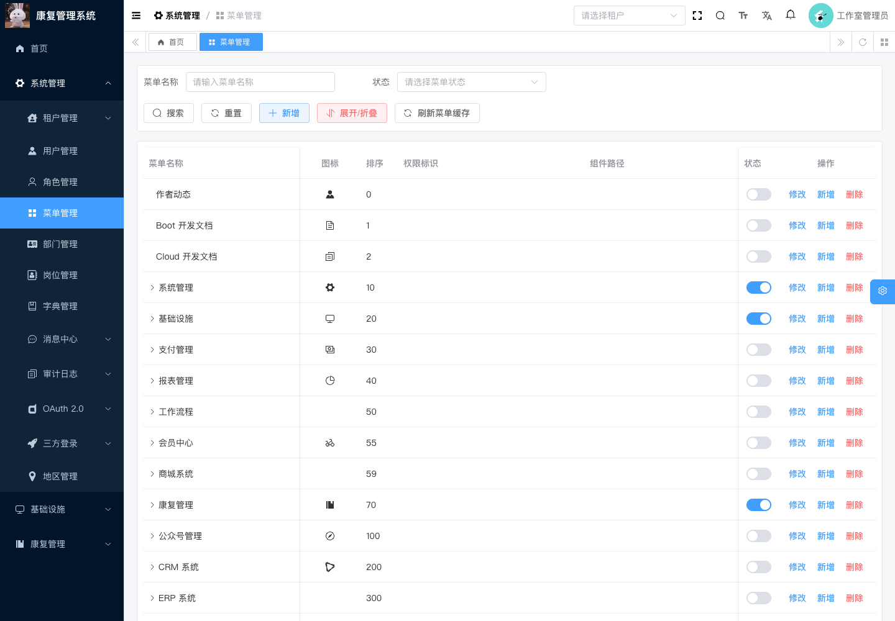

# 运动康复评估与业务管理系统

简称：**康复管理系统**

版本：**V1.0 / 1.0.0**

这是一个面向运动康复工作室内部使用的本地管理系统，覆盖患者建档、康复周期、评估、报告、
训练计划、训练执行、进度追踪、风险提醒、随访和复评等业务。

项目基于芋道 `ruoyi-vue-pro` 二次开发。康复业务、桌面启动器、内部部署、安全加固和发布流程
由本项目补充；上游作者、版权信息及 MIT License 保持不变。

> 本系统用于康复评估和业务记录，不替代医疗诊断。当前版本默认关闭 AI、商城、支付、IoT、
> BPM 等未交付模块，不包含遥测、广告、第三方统计或患者数据云上传。

## 下载桌面安装包

桌面测试版发布页：

[下载康复管理系统 V1.0 桌面预发布版 preview.3](https://github.com/SaberAltriaYi/rehab-management-system/releases/tag/desktop-v1.0.0-preview.3)

| 平台 | 安装包 | 支持范围 |
| --- | --- | --- |
| Windows | `康复管理系统_1.0.0_windows-x64_unsigned-setup.exe` | Windows 10/11 x64 |
| macOS | `康复管理系统_1.0.0_macos-universal_unsigned.dmg` | Apple Silicon 与 Intel |

安装包内已经包含编译后的 Spring Boot 后端、Vue 管理端、Docker Compose、Nginx 配置和数据库
初始化资源。最终用户不需要安装 JDK、Maven、Node.js 或 pnpm。

### 当前预发布版说明

当前安装包尚未完成 Windows Authenticode 签名和 Apple Developer ID 公证，因此文件名带
`_unsigned`，Windows SmartScreen 或 macOS Gatekeeper 可能显示安全提醒。它们只用于可信
工作室内部测试，不建议作为公开生产发行包传播。

下载后请同时下载发布页中的 `SHA256SUMS.txt` 并校验文件。不要使用来源不明或校验不一致的
安装包。

## 后台入口与使用说明

安装完成后，先启动 Docker Desktop，再打开“康复管理系统”启动器，点击“启动服务”；等待
MySQL、Redis、后端和管理端全部健康后，点击“打开系统”。默认后台地址为
`https://127.0.0.1:8443`，租户为 `工作室内部`，用户名为 `admin`，初始密码由启动器在首次
启动时随机生成并显示。

首次登录后请立即进入“个人中心 → 密码设置”修改管理员密码，再到“系统管理 → 用户管理”
为每位成员创建独立账号并分配最小权限。患者建档、评估、报告、训练、打卡、风险处理和复评
的完整操作步骤见：

**[康复管理系统后台管理使用说明](docs/admin-user-guide.md)**

移动设备不能访问桌面版的 `127.0.0.1`。同一 Wi-Fi/局域网访问需要先完成
[局域网一键部署](deploy/lan/README.md)，再使用部署设备的具体私网 IP 进入后台。

## 主要功能

| 模块 | 功能 |
| --- | --- |
| 工作台 | 带业务图标的患者、待复评、高风险、低依从性及近期业务概览 |
| 患者管理 | 患者档案、Excel 批量导入/导出、状态、治疗师归属、附件和操作记录 |
| 康复周期 | 以 Episode 管理一次完整康复周期及阶段流转 |
| 康复评估 | 静态评估、身体成分、NASM-CES、SFMA、FMS、YBT、OpenCap、观察和综合评估 |
| SFMA | 按顶层动作筛查、分解评估和纠正方向记录评估过程 |
| 评估报告 | 按 17 页 V4.1 模板输出患者信息与各评估板块原始数据，支持 DOCX/PDF |
| 训练计划 | 为患者和康复周期创建、调整、复制、启用和归档计划 |
| 训练任务 | 将计划拆分为可执行训练任务，管理动作、频次和完成要求 |
| 课程签到 | 按患者、训练计划和实际上课日期签到，同日可记录多节课 |
| 进度追踪 | 汇总任务执行、训练完成率和近期康复趋势 |
| 复评管理 | 复评触发、到期提醒、复测结果和前后变化对照 |
| 风险提醒 | 疼痛、低依从性、待复评和持续高风险提醒 |
| 随访通知 | 记录随访备注，向患者侧生成可读提醒 |
| 后台管理 | 用户、角色、菜单、部门、租户、日志、文件和系统配置 |
| 审计与权限 | 登录认证、租户隔离、患者可见范围、操作日志和最小权限控制 |

当前没有独立预约模块。可交付业务链路为：

```text
患者建档
  → 创建康复周期 Episode
  → 完成初评/专项评估
  → 审核并导出评估报告
  → 制定训练计划
  → 下发训练任务
  → 训练打卡与随访
  → 查看进度和风险
  → 触发复评
  → 调整计划或结束康复周期
```

## 界面预览

本次补充的浅色主题截图来自 V1.0 本机桌面运行环境，使用初始化后的空数据库拍摄，不包含真实
患者、手机号、密码、Token 或生产数据。下方同时保留维护者此前提交的深色主题工作台截图，
截图未展示患者姓名或联系方式。不同角色看到的菜单和按钮会因权限及患者归属而不同。

### 登录后台

登录时填写租户、用户名和密码。默认租户为“工作室内部”；管理员初始密码仅由启动器在首次
启动阶段显示，仓库和截图中不包含任何默认密码。



### 康复工作台

工作台将个人待办和机构总览集中在一页，便于负责人快速查看患者、执行中计划、待复评、
高风险、低依从、近期报告、异常打卡和治疗师负载。



### 深色主题工作台

以下两张截图展示深色主题下的工作台指标和“康复管理”完整侧栏菜单：


## 康复管理功能详解

“康复管理”是系统的核心业务板块。推荐从“患者管理”进入患者详情，然后沿同一患者、同一
Episode 完成评估、报告、计划、训练执行和复评，避免业务记录关联错误。

### 1. 康复工作台

- **我的工作台**：显示当前治疗师负责的患者、执行中计划、待复评、高风险、低依从、本周
  新增评估和未读通知。
- **机构全量总览**：管理员可查看患者总量、活跃患者、活跃计划、报告生成/导出数量和机构
  平均打卡完成率。
- **最近待处理提醒**：集中展示疼痛升高、低依从、复评到期、计划到期等近期事项。
- **风险类型分布**：按风险类型汇总数量和占比，帮助负责人识别当前主要风险来源。
- **近期业务**：展示最近生成报告、最近异常打卡和治疗师患者/计划负载。
- **刷新数据**：手工重新获取最新汇总；工作台只做概览，最终处理仍应进入对应业务详情。

### 2. 患者管理与康复周期

患者管理承担患者主档、治疗师归属和完整业务时间线管理。

- **查询与批量导出**：按姓名、手机号、患者编号、治疗师、阶段、CRM 状态、性别、来源及
  创建时间筛选；批量导出完整患者名单为 Excel，文件包含个人信息，只能保存到受控位置。
- **Excel 批量导入**：先下载标准模板，单次最多导入 2000 行；患者编号重复，或“姓名＋
  手机号”重复时自动跳过且不覆盖已有档案。部分失败不会回滚已成功行，可下载带行号和原因的
  失败清单修正后再次导入。
- **新建患者**：记录姓名、联系方式、性别、年龄、主诉、疼痛部位、疼痛评分、来源渠道和
  备注。新建时可同时初始化第一个 Episode。
- **Episode 康复周期**：用 `initial`、`followup`、`maintenance`、`return_to_sport` 等类型
  表示一次康复目标明确的业务周期，保存阶段、状态、起止时间和主要目标。
- **治疗师分配/转交**：指定主责或协作治疗师；转交时结束旧归属并保留原因和操作记录。
- **患者详情**：在一个页面查看患者基本信息、当前 Episode、评估、报告、计划、任务、打卡、
  进度、复评触发、分配历史及操作日志。
- **CRM/会员绑定**：仅在机构明确启用对应上游模块时用于关联现有客户或患者端账号；内部
  V1.0 不依赖该功能完成核心康复流程。
- **编辑、归档和删除**：档案纠错使用编辑；有效业务记录应优先保留或归档，删除只用于确认
  无效且符合数据管理制度的记录。



### 3. 评估管理

评估管理将一次评估与患者、Episode、评估人和评估日期绑定，支持草稿保存、结构化录入、
结果汇总、质量检查、报告生成和归档。

| 评估类型 | 主要记录内容 |
| --- | --- |
| 静态评估 | 前、后、侧面体态排列，异常项和基础量化观察 |
| 身体成分 | 体重、BMI、体脂、肌肉量等身体成分指标 |
| NASM-CES | 动作偏差、可能紧张/薄弱结构和纠正训练取向 |
| SFMA | 顶层动作筛查、功能/非功能及疼痛分类、分解评估与纠正方向 |
| FMS | 基础动作模式评分、左右差和疼痛标记 |
| YBT | 上肢或下肢平衡距离、标准化值及左右差 |
| OpenCap / OpenSim | 运动学专项数据、关键指标和左右对比 |
| 人工观察记录 | 治疗师主观观察、患者反馈和无法结构化的补充信息 |
| 综合评估 | 组合多个评估模块，形成整体风险、结论和建议 |

主要操作包括：

- 按患者、Episode、类型、日期、评估人和状态筛选评估；
- 新建评估时填写本次重点、疼痛评分、红旗备注和专项表单；
- 未完成时保存草稿，完成后核对数据状态、质量等级、置信等级和异常项；
- 从评估详情直接创建训练计划或生成评估报告；
- 归档已完成记录，只有确认无效时才删除；
- SFMA、FMS、NASM-CES 等方法的使用应由具备相应能力的人员负责，并遵守相关权利和使用
  依据；系统记录不替代临床判断。



### 4. 报告中心

报告中心将结构化评估原始数据按《运动康复综合评估报告模板 V4.1》整理成可复核、可追踪的
17 页报告。

- **生成**：从评估列表或详情生成报告，保留患者、Episode 和来源评估关系。
- **预览**：在导出前检查患者、评估编号及各板块原始数据是否完整。
- **复核与审批**：报告按 `draft → reviewed → approved` 流转，不同人员按权限执行复核和审批。
- **原始数据策略**：系统只自动填入患者/评估基本信息及身体成分、观察、静态、NASM、SFMA、
  FMS、YBT、OpenCap、综合评估和量表等原始字段；解释、风险判断、训练方案及 GPT 解读区域
  保持为空，供专业人员另行处理。
- **导出**：生成版式一致的 DOCX 或 PDF；后端运行镜像内置 LibreOffice 和中文字体完成转换，
  导出后记录报告状态和审计信息。
- **锁版/解锁**：已确认报告可锁版防止误改；解锁需要具备权限并填写人工复核原因。
- **版本历史**：查看版本号、状态、生成模式、变更说明和时间。
- **报告审计**：查看生成、复核、审批、导出、锁版和解锁等关键操作及结果。

报告包含患者信息。不得上传到公开 Issue、个人公开网盘、普通群聊或其他未经批准的位置。



### 5. 训练计划中心与训练任务

训练计划把评估结论转化为可执行的阶段目标和任务。

- **创建计划**：选择患者、Episode、来源评估和主责治疗师，填写计划名称、类型、起始日期、
  周期、复评周期和强度。
- **目标与安全信息**：保存短/中/长期目标、禁忌、注意事项、家庭训练及院内训练开关。
- **计划状态**：支持草稿、激活、暂停、完成和关闭；激活前应完成内容与安全复核。
- **计划复制**：在保留来源关系的前提下复制既有计划，再按当前患者情况调整。
- **训练任务**：将计划拆分为活动度、稳定性、控制、整合、负荷、呼吸、平衡等任务，记录
  家庭/院内执行方式、组数、次数、保持时间、周频次和剂量文本。
- **任务维护**：支持新增、编辑、排序、停用和重新启用，不直接覆盖历史打卡。
- **进度追踪**：按周期汇总计划任务数、完成任务数、完成率、依从性、疼痛趋势和建议动作。
- **复评触发**：在计划详情中查看或手工建立复评触发，并转入后续复测流程。



### 6. 课程签到

- 按患者、训练计划和日期查询实际上课记录；
- 点击“签到上课”，选择患者、该患者的执行中训练计划、训练日期并填写可选备注；
- 同一患者同一天上多节课时可分别签到，系统不会按日期去重；
- 课程签到仅证明患者到店上课，不会自动完成训练任务、重算计划进度或触发复评；
- 升级前已有的详细训练打卡和任务执行数据继续保留，并可通过“任务明细”查看。

### 7. 复评触发

复评触发将计划执行过程中需要重新评估的情况转成可跟踪待办。

- 支持时间到期、疼痛升级、低依从、阶段结束、目标未达成和目标已达成等触发类型；
- 保存触发等级、说明、建议动作、到期日期和处理人；
- **确认**表示负责人已接收待办，**转复评**用于建立后续复测，**忽略**只适用于确认不需要
  处理的误报或不适用记录；
- 复评应继续关联原患者和正确 Episode，并尽量采用可与初评比较的评估类型和测量条件。

### 8. 通知中心

- 展示任务提醒、复评到期、低依从、疼痛提醒、报告就绪、计划更新、触发创建和系统通知；
- 默认以“只看本人”为范围，可按通知类型和已读状态筛选；
- 支持单条已读和全部已读；删除通知需要相应权限；
- 通知只是业务提醒，不能代替风险处理、随访记录或治疗师人工确认。

### 9. 风险提醒中心

- 汇总复评到期、低依从、疼痛升级、计划到期、报告就绪和高风险未解决等提醒；
- 按提醒类型、级别和状态筛选，点击“刷新提醒”重新计算当前风险；
- **确认**表示已接收，**解决**表示已经完成实际处理，**忽略**要求有合理依据；
- 处理前必须回看患者详情、评估、计划和打卡原始记录，系统风险等级不替代专业判断。



### 10. 机构运营看板

面向管理员汇总患者总量、活跃患者、活跃计划、本周新增评估、待复评、高风险、报告生成与
导出、低依从和平均打卡完成率，并展示治疗师负载排行和风险类型分布。运营数据用于安排工作
和发现积压，不应脱离原始业务记录作为临床结论。

### 11. 康复审计日志

按模块、操作类型和结果查询康复业务关键操作，记录模块对象、操作人、成功/失败结果、备注和
时间。报告锁版、风险处理、计划状态变化等争议操作应先查审计日志，不要直接修改数据库。

### 12. AI 相关菜单状态

代码中保留“AI 内容中心”“AI 配置中心”和“提示词模板中心”的扩展能力，但 V1.0 内部构建
默认关闭并从日常业务菜单隐藏。当前交付不配置模型密钥、不发送患者数据到外部模型，也不应
由管理员自行开启。核心患者、评估、报告、计划、打卡、风险和复评功能均可在 AI 关闭时运行。

## 系统管理功能详解

“系统管理”主要由负责人维护账号、组织、权限和基础字典。康复治疗师和文员日常不应拥有
系统配置权限；任何权限变更都应使用独立管理员账号并保留操作日志。

### 1. 租户管理

- **租户列表**：维护租户名称、联系人、账号数量、到期时间和启停状态。
- **租户套餐**：定义某类租户可以使用的菜单集合和账号配额。
- 当前内部部署默认只有“工作室内部”一个租户。没有多机构运营需求时不要新增租户或切换
  租户，避免成员登录到错误的数据隔离空间。

### 2. 用户管理

- 新建成员账号，维护昵称、登录名、部门、手机号、邮箱、性别、岗位和备注；
- 启用或停用账号，重置遗忘密码，分配角色；
- 按部门、用户名、手机号、状态和创建时间查询；支持受控导入与导出；
- 一人一号，首次登录立即改密，成员离职或停止合作当天停用并完成患者转交；
- 日常工作不得共用 `admin`，不得在备注、群聊或文档中保存明文密码。



### 3. 角色管理

- 创建和维护业务角色，设置角色名称、标识、排序、状态和备注；
- **菜单权限**决定账号能看到的页面和按钮；
- **数据权限**决定可访问的部门或业务数据范围；
- 康复治疗师应获得患者、评估、报告、计划、打卡和风险所需权限；其他岗位按职责最小授权；
- 超级管理员只授予明确负责人，修改后使用普通账号重新登录验证权限边界。



### 4. 菜单管理

- 维护目录、页面和按钮权限的名称、路由、组件、图标、排序、权限标识、显示和启停状态；
- “刷新菜单缓存”用于权限或菜单调整后重新加载路由；
- 康复菜单同时承载患者查看、评估新增、报告审批、风险处理等细粒度按钮权限；
- V1.0 中支付、商城、BPM、IoT 等未交付模块保持停用。不要通过打开菜单开关绕过交付边界；
- 非开发维护不得删除根菜单、修改组件路径或批量启用上游演示模块。



### 5. 部门管理

- 建立工作室、门店、康复组等组织树，维护负责人、联系电话、邮箱、排序和状态；
- 用户归属、角色数据范围和部分统计以部门为依据；
- 调整组织结构前先确认对患者可见范围和治疗师数据权限的影响。

### 6. 岗位管理

- 维护负责人、康复治疗师、前台/文员等岗位名称、编码、排序和状态；
- 岗位用于人员组织信息，不自动等同于权限；实际访问范围仍由角色、菜单和数据权限决定。

### 7. 字典管理

- 维护系统使用的字典类型和字典数据，如状态、类别、标签、显示颜色和排序；
- 字典值可能已被前后端和历史数据引用，修改“显示名称”通常比修改“值”安全；
- 不得随意删除已使用字典项或改写内部值，变更前应评估接口、报表和历史数据兼容性。

### 8. 消息中心

消息中心来自上游后台框架，包含：

- **短信管理**：短信渠道、短信模板和发送日志；
- **邮箱管理**：邮箱账号、邮件模板和邮件记录；
- **站内信管理**：站内信模板和消息记录；
- **通知公告**：面向后台成员发布通知或公告。

内部 V1.0 不预置第三方短信/邮件凭据，也不需要外部消息服务完成康复主流程。除站内通知外，
如需启用外发短信或邮件，必须单独完成供应商合规、安全评审、密钥管理和患者授权，不得把密钥
写入 Git 或截图。

### 9. 审计日志

- **操作日志**：记录后台接口、操作人、请求方式、结果、耗时和时间，用于排查配置与权限变更；
- **登录日志**：记录登录账号、结果、来源、浏览器和时间，用于发现异常登录；
- 日志中不应记录密码、Token 或患者完整业务内容；日志导出也按敏感材料管理。

“系统管理 → 审计日志”是通用后台日志，“康复管理 → 审计日志”是康复业务关键动作日志，
两者用途不同，排障时可以结合查看。

### 10. OAuth 2.0

- **应用管理**：维护内部客户端标识、授权类型、重定向地址和令牌有效期；
- **令牌管理**：查看和撤销已签发的访问令牌；
- 内部安装依赖经过加固的登录客户端。不要删除或开放改造默认客户端，也不要降低认证、租户
  隔离或令牌安全设置。

### 11. 三方登录

- **三方应用**：配置受支持的第三方身份提供方；
- **三方用户**：查看第三方身份与本地账号的绑定关系；
- V1.0 默认不配置第三方登录。启用会增加外部网络、密钥和账号绑定风险，必须单独评审，不能
  用它绕过工作室成员账号管理。

### 12. 地区管理

- 维护省、市、区等行政区划基础数据，供地址选择和标准化展示使用；
- 更新地区数据前应确认上游数据来源、编码稳定性以及对已有地址记录的影响。

系统管理页面中的删除、批量删除、菜单启停、令牌撤销和租户停用均属于高影响操作。操作前应
创建备份、核对目标和影响范围；不要直接操作数据库来规避页面权限和审计。

## 技术架构

| 层级 | 技术 |
| --- | --- |
| 桌面启动器 | Tauri v2、Rust、TypeScript、Vite |
| 管理端 | Vue 3、Vite、Element Plus、Pinia |
| 后端 | Java 8、Spring Boot 2.7.18、Maven 多模块 |
| 权限与会话 | Spring Security、Token、Redis、多租户 |
| 数据库 | MySQL 8.4 |
| 缓存 | Redis 7.4 |
| 网关与静态资源 | Nginx 1.30 |
| 容器编排 | Docker Compose v2 |
| 自动化发布 | GitHub Actions、NSIS、DMG |

桌面安装包不是把 MySQL 或 Redis 改成嵌入式数据库。V1.0 继续使用 Docker Compose 运行
MySQL、Redis、Spring Boot 和 Nginx，以保持现有数据模型、事务、迁移脚本和部署方式。

## 桌面版安装

### 前置条件

1. 安装当前受支持的 Docker Desktop。
2. 启动 Docker Desktop，并等待 Engine Running。
3. 确认 `docker compose version` 可以正常执行。
4. 建议至少 2 核 CPU、4 GB 可用内存和 20 GB 可用磁盘。
5. 首次启动需要能够访问 Docker 镜像仓库。

启动器只检测 Docker，不会静默下载或安装 Docker Desktop。

### Windows

1. 从发布页下载 Windows `.exe` 和 `SHA256SUMS.txt`。
2. 在 PowerShell 中校验：

   ```powershell
   Get-FileHash ".\康复管理系统_1.0.0_windows-x64_unsigned-setup.exe" -Algorithm SHA256
   ```

3. 运行安装器。安装器会创建开始菜单入口，并可选择创建桌面快捷方式。
4. 启动 Docker Desktop。
5. 从开始菜单打开“康复管理系统”。

Windows 版本不要求 Git Bash，也不要求用户在 WSL 中运行脚本。

详细说明见 [Windows 安装与卸载](docs/desktop-install-windows.md)。

### macOS

1. 从发布页下载 universal DMG 和 `SHA256SUMS.txt`。
2. 在终端中校验：

   ```bash
   shasum -a 256 "康复管理系统_1.0.0_macos-universal_unsigned.dmg"
   ```

3. 打开 DMG，将“康复管理系统”拖入 Applications。
4. 启动 Docker Desktop。
5. 从 Applications 打开“康复管理系统”。

详细说明见 [macOS 安装与卸载](docs/desktop-install-macos.md)。

不要通过全局关闭 Gatekeeper 或 TLS 校验来部署正式版本。

## 第一次启动

首次点击“启动服务”时，启动器会：

1. 检查 Docker CLI、Docker daemon 和 Compose v2。
2. 校验并复制安装包内的 V1.0.0 运行资源。
3. 生成彼此不同的 MySQL 业务密码、MySQL root 密码和 Redis 密码。
4. 生成备份加密口令和本机 TLS 证书。
5. 检查默认端口 `8080` 和 `8443`；冲突时提示修改端口。
6. 拉取固定版本、固定摘要的基础镜像。
7. 创建 MySQL、Redis、康复附件和日志数据卷。
8. 初始化空数据库并执行 19 个受校验迁移版本。
9. 启动 MySQL、Redis、后端和管理端并等待健康检查。
10. 显示首次登录信息。

默认登录信息：

| 项目 | 内容 |
| --- | --- |
| 租户 | `工作室内部` |
| 用户名 | `admin` |
| 初始密码 | 由启动器生成 16 位随机密码，并仅在首次启动阶段显示 |
| 默认地址 | `https://127.0.0.1:8443` |

首次登录后必须立即修改管理员密码，并为每位成员创建独立账号、角色和最小权限。日常工作不要
共用管理员账号。

早期 `desktop-v1.0.0-preview.1` 构建曾错误生成 48 位管理员临时密码。更新后的登录接口兼容
该旧临时密码；登录后请立即在“个人中心 → 密码设置”改为 4–16 位新密码。新安装包只生成
16 位管理员临时密码，MySQL、Redis 和备份口令仍保持 48 位。

首次浏览器访问可能出现本机证书提醒。长期使用时应将用户数据目录下
`config/tls/server.crt` 加入本机受信任证书存储，不要关闭浏览器 TLS 校验。

## 启动器使用

启动器主页提供：

- Docker、MySQL、Redis、后端和管理端状态；
- 启动、停止和重启服务；
- 服务健康后打开管理系统或点击“进入后台管理”；
- 修改本机 HTTP/HTTPS 端口；
- 查看经过敏感信息脱敏的近期日志；
- 打开用户数据目录；
- 创建数据库和附件加密备份；
- 一键导出包含完整业务数据库、系统用户/权限和附件的加密整店迁移包；
- 一键导入整店迁移包；导入前强制自动备份目标设备，再全量覆盖数据库和附件；
- 设置内置超级管理员账号和 12–16 位密码，保存后旧令牌立即失效；
- 复制不含密码、Token 和患者记录的诊断信息；
- 查看最近备份和最近错误；
- 通过精确确认文字执行彻底删除。

关闭启动器默认不会停止后台服务。普通停止使用 `docker compose stop`，不会删除数据卷。

整店迁移包使用用户设置的 12–128 位密码进行 age 加密，扩展名为 `.rehab-transfer`。它包含
患者等敏感业务数据，但不会包含目标设备的 MySQL/Redis 运行密码、TLS 私钥、端口、日志、
缓存或本机备份。迁移密码必须通过独立安全渠道传递。

## 数据位置

应用配置、证书、日志索引和备份位于操作系统用户数据目录：

```text
Windows: %APPDATA%\com.saberaltriayi.rehab\
macOS:   ~/Library/Application Support/com.saberaltriayi.rehab/
```

业务数据使用以下 Docker named volumes：

```text
rehab-desktop-mysql-data
rehab-desktop-redis-data
rehab-desktop-rehab-data
rehab-desktop-server-logs
```

安装目录不保存数据库和患者附件。重启、普通更新、重装和卸载桌面程序都不会删除这些卷。

## 备份、更新与卸载

### 创建备份

在四个服务全部健康时点击“创建备份”。备份输出到用户数据目录的 `backups/`：

```text
rehab-<UTC时间>.sql.age
rehab-<UTC时间>-attachments.tar.gz.age
rehab-<UTC时间>.json
```

备份包含患者数据，必须存放在受控加密介质。备份文件和解密口令应分开保存，不得上传到公开
Issue、网盘或 Git 仓库。

### 更新

1. 在旧版本启动器中创建备份。
2. 退出启动器，但不删除数据。
3. 安装新版本。
4. 启动服务并完成健康检查。
5. 核对登录、患者数量、评估、附件和迁移账本。

升级不会自动回滚数据库迁移。失败时应保留旧数据卷、日志和升级前备份。

### 总店数据迁移到分店

1. 总店启动器确认四项服务健康，点击“一键导出整店数据”，设置 12–128 位迁移密码并保存
   `.rehab-transfer` 文件。
2. 通过受控加密介质复制迁移包，迁移密码通过其他安全渠道传递。
3. 分店先安装同版本或更高的已验收版本并启动至全部健康。
4. 点击“一键导入整店数据”，选择迁移包、输入密码及确认文字 `覆盖导入全部数据`。
5. 启动器先自动备份分店现有数据，再全量替换数据库和附件，保留分店本机密码、TLS 和端口。
6. 导入后核对管理员登录、患者数量、权限、评估、报告和附件。

### 卸载

正常卸载只删除桌面程序，默认保留数据库、Redis、附件、日志和备份。只有在启动器仍可运行、
Docker 正常，并且用户完成危险区二次确认时，才允许删除全部本地数据。

禁止将以下命令作为普通停止或卸载操作：

```bash
docker compose down -v
```

完整说明见 [备份与迁移](docs/desktop-backup-migration.md)。

## 局域网部署

桌面 V1.0 默认只监听 `127.0.0.1`，不接受 `0.0.0.0`，也不自动配置局域网或路由器端口
转发。

需要同一 Wi-Fi/局域网访问时，可以使用局域网一键部署脚本。将示例 IP 替换成部署设备的固定
私网 IPv4：

macOS、Linux 或 NAS：

```bash
chmod +x install.sh
./install.sh 192.168.1.100
```

Windows PowerShell：

```powershell
Set-ExecutionPolicy -Scope Process Bypass
.\install.ps1 192.168.1.100
```

安装完成后，在成员设备访问 `http://部署设备IP:8080/ca.crt` 安装局域网 CA，然后打开
`https://部署设备IP:8443`。首次登录信息只在部署设备本地生成，不进入发布包或 Git。
详细说明见 [局域网一键部署文档](deploy/lan/README.md)。

需要手工控制每个部署步骤时，使用经过独立验收的 `deploy/internal/` 方案：

```bash
cp deploy/internal/.env.example deploy/internal/.env
chmod 600 deploy/internal/.env

deploy/internal/generate-tls.sh
deploy/internal/generate-backup-key.sh
deploy/internal/preflight.sh

docker compose --env-file deploy/internal/.env \
  -f deploy/internal/docker-compose.yml up -d --build

deploy/internal/check-database.sh
deploy/internal/smoke-test.sh
```

必须选择部署机明确的私网 IPv4，禁止使用 `0.0.0.0`，并在成员设备安装局域网 CA。不要配置
公网端口转发。

详细说明见 [工作室内部部署手册](deploy/internal/README.md)。

## 本地开发

### 开发环境

- JDK 17 LTS（编译目标兼容 Java 8）
- Maven 3.9
- Node.js 20 或 22
- pnpm 10.15.1
- Rust stable
- Docker Desktop / Docker Engine + Compose v2

### 后端测试与构建

```bash
mvn -B -ntp -pl yudao-module-rehab -am test

mvn -B -ntp \
  -pl yudao-framework/yudao-spring-boot-starter-web \
  -am \
  -Dtest=ApiAccessLogInterceptorTest,GlobalExceptionHandlerTest \
  -Dsurefire.failIfNoSpecifiedTests=false \
  test

deploy/internal/build-server-isolated.sh
```

后端产物：

```text
yudao-server/target/yudao-server.jar
```

### 内部管理端

```bash
cd yudao-ui/yudao-ui-admin-vue3-app
pnpm install --frozen-lockfile
pnpm build:internal
```

前端产物：

```text
yudao-ui/yudao-ui-admin-vue3-app/dist-internal/
```

### 桌面启动器

```bash
cd desktop/launcher
pnpm install --frozen-lockfile
pnpm test
pnpm cargo:test
```

Windows 安装器：

```powershell
pnpm tauri build --bundles nsis --target x86_64-pc-windows-msvc
```

macOS universal DMG：

```bash
pnpm tauri build --bundles dmg --target universal-apple-darwin
```

### 最小运行资源

```bash
node desktop/scripts/build-sanitized-bootstrap.mjs
node desktop/scripts/build-runtime.mjs
node desktop/scripts/check-runtime.mjs desktop/runtime/1.0.0
```

只允许在没有现存 `rehab-desktop-*` 数据卷的隔离 Docker 环境运行真实端到端测试：

```bash
desktop/scripts/test-runtime-e2e.sh
```

## GitHub Actions 发布

工作流文件：`.github/workflows/desktop-release.yml`

支持：

- Actions 页面手动运行；
- 向 `master` 提交 Pull Request 时验证；
- 推送 `v*` 或 `desktop-v*` 标签时构建两个平台；
- 先运行后端测试、前端构建和真实 Docker E2E；
- Windows runner 生成 NSIS；
- macOS runner 生成 universal DMG；
- 上传安装包、SHA-256 和构建信息；
- 标签构建全部通过后创建 draft Release；
- 没有签名 Secret 时仍生成明确标记为 unsigned 的测试构建。

正式发布前的签名配置见 [桌面签名与公证](docs/desktop-signing.md)。

## 项目目录

```text
.
├── desktop/
│   ├── launcher/                 # Tauri v2 桌面启动器
│   ├── runtime-template/         # 最小 Docker 运行模板
│   ├── scripts/                  # 运行资源构建、检查和 E2E
│   └── sql/                      # 脱敏空库处理
├── deploy/internal/              # 局域网内部部署与运维
├── docs/                         # 桌面安装、签名、备份和排障文档
├── sql/mysql/                    # MySQL 基线与迁移入口
├── yudao-module-rehab/           # 康复业务后端模块
├── yudao-server/                 # Spring Boot 启动模块
└── yudao-ui/
    └── yudao-ui-admin-vue3-app/  # Vue 3 内部管理端
```

## 安全与隐私

- 默认仅绑定 `127.0.0.1`；
- 不添加遥测、广告、第三方统计或患者数据上传；
- 三个基础设施密码彼此不同，首次启动随机生成；
- 密码、Token、患者字段和手机号不会进入诊断信息；
- 配置和密钥保存在用户数据目录，而非安装目录；
- Docker 镜像固定版本和摘要，不使用 `latest`；
- 患者附件限制文件类型、文件名和大小；
- 正常操作不会执行 `docker compose down -v`；
- 数据删除必须二次确认并输入精确确认文字；
- AI、商城、支付、IoT、BPM 默认关闭；
- 数据库迁移使用固定校验和账本，不假设可以自动回滚。

如需报告安全问题，请不要在公开 Issue 附加数据库、原始日志、截图、备份、密码、Token 或真实
患者信息。

## 已知限制

- 桌面版仍需要 Docker Desktop；
- 首次运行需要下载固定基础镜像；
- V1.0 桌面启动器仅支持本机访问；
- 没有独立预约模块；
- 没有自动更新服务；
- 本机历史备份恢复仍属于受控管理员流程；跨设备整店迁移已提供加密一键导入/导出；
- 当前发布为 unsigned 预览版，正式分发仍需 Windows 签名及 macOS 公证；
- 患者字段未做数据库列级加密，部署主机必须启用磁盘加密、账号隔离和加密备份。

## 相关文档

- [桌面版使用与部署](docs/desktop-packaging.md)
- [Windows 安装与卸载](docs/desktop-install-windows.md)
- [macOS 安装与卸载](docs/desktop-install-macos.md)
- [备份与迁移](docs/desktop-backup-migration.md)
- [签名与公证](docs/desktop-signing.md)
- [故障排查](docs/desktop-troubleshooting.md)
- [发布检查清单](docs/desktop-release-checklist.md)
- [局域网一键部署](deploy/lan/README.md)
- [内部生产部署](deploy/internal/README.md)
- [V1.0 变更记录](CHANGELOG.md)
- [V1.0 软件著作权材料目录](docs/software-copyright/v1.0/README.md)
- [权属说明](COPYRIGHT.md)
- [上游与第三方声明](NOTICE.md)

## 上游与许可证

本项目基于以下开源项目进行二次开发：

- 芋道 `ruoyi-vue-pro`：<https://github.com/YunaiV/ruoyi-vue-pro>
- 芋道 Vue3 管理后台：<https://gitee.com/yudaocode/yudao-ui-admin-vue3>
- 芋道开发文档：<https://doc.iocoder.cn/>

本项目不是芋道官方项目。“芋道”“RuoYi-Vue-Pro”及相关标识的权利归原项目及其作者所有。
本项目保留上游作者、提交历史、版权与许可证信息，具体许可条款见 [LICENSE](LICENSE)、
[NOTICE.md](NOTICE.md) 和 [THIRD_PARTY_NOTICES.md](THIRD_PARTY_NOTICES.md)。

使用、修改和分发前请同时遵守仓库中保留的上游许可证及第三方许可证。

SFMA、FMS、NASM-CES 等方法内容目前无授权或其他使用依据，不属于杨玺龙的软件著作权权利
主张；软件著作权鉴别材料排除相关规则、表单和说明。继续使用、展示或分发相关内容前，应取得
合法依据，或替换为经过审查的原创通用表达。自研代码及权利范围详见
[COPYRIGHT.md](COPYRIGHT.md)。
